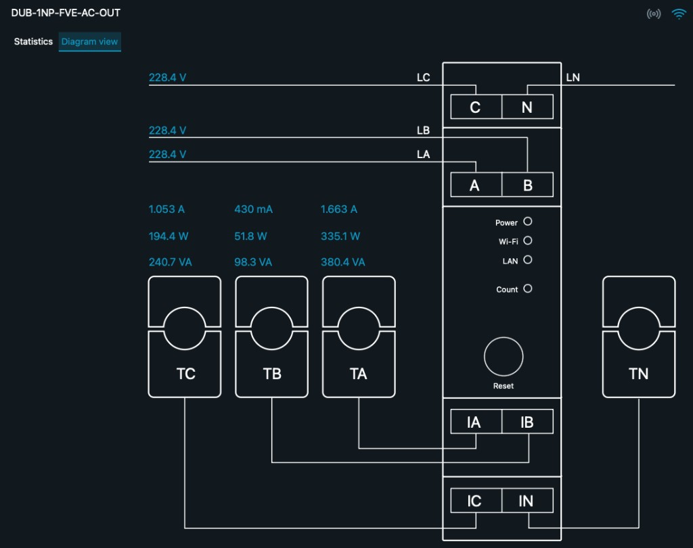

# Shelly 3EM Diagram Card

Custom Lovelace karta pro Home Assistant — live diagram **Shelly Pro 3EM**
ve stylu Shelly Cloud „Diagram view“ (napětí, proud a výkon po fázích).



- Centrální blok elektroměru se svorkami C/N, A/B, IA/IB, IC/IN
- Vstupní linky LC / LB / LA s napětím (V)
- CT clampy TC / TB / TA / TN s proudem (A) a výkonem (W)
- Pulzující indikace toku úměrná proudu
- Klik na hodnotu otevře nativní HA more-info dialog
- Respektuje HA theme CSS proměnné

## Předpoklady

| Komponenta | Integrace | Co dodává |
| --- | --- | --- |
| **Shelly Pro 3EM** | nativní [Shelly](https://www.home-assistant.io/integrations/shelly/) | napětí, proud a výkon po fázích, celkový výkon / energie |

Konkrétní entity se mapují v YAML — karta není závislá na přesných názvech.

## Instalace

### HACS (doporučeno)

1. HACS → tři tečky → **Custom repositories**
2. URL tohoto repozitáře, kategorie **Dashboard**
3. Nainstaluj **Shelly 3EM Diagram Card** a reloadni prohlížeč

### Ručně

1. Stáhni `shelly-3em-diagram-card.js` z posledního [release](../../releases)
2. Zkopíruj do `/config/www/`
3. Nastavení → Dashboardy → ⋮ → Zdroje → Přidat:
   URL `/local/shelly-3em-diagram-card.js?v=0.1.0`, typ **JavaScript module**

## Konfigurace

```yaml
type: custom:shelly-3em-diagram-card
title: DUB-1NP-FVE-AC-OUT
phase_a:
  voltage: sensor.dub_1nb_grid_ac_in_phase_a_napeti
  current: sensor.dub_1nb_grid_ac_in_phase_a_proud
  power: sensor.1np_vstupni_chodba_dub_1nb_grid_ac_in_phase_a_vykon
phase_b:
  voltage: sensor.dub_1nb_grid_ac_in_phase_b_napeti
  current: sensor.dub_1nb_grid_ac_in_phase_b_proud
  power: sensor.1np_vstupni_chodba_dub_1nb_grid_ac_in_phase_b_vykon
phase_c:
  voltage: sensor.dub_1nb_grid_ac_in_phase_c_napeti
  current: sensor.dub_1nb_grid_ac_in_phase_c_proud
  power: sensor.1np_vstupni_chodba_dub_1nb_grid_ac_in_phase_c_vykon
total_power: sensor.1np_vstupni_chodba_dub_1nb_grid_ac_in_vykon
total_energy: sensor.1np_vstupni_chodba_dub_1nb_grid_ac_in_energie
```

### Položky konfigurace

| Klíč | Povinné | Popis |
| --- | --- | --- |
| `title` | ne | Titulek v headeru |
| `phase_a` / `phase_b` / `phase_c` | ano* | Objekty s `voltage`, `current`, `power` (entity ID) |
| `total_power` | ne | Celkový výkon v headeru |
| `total_energy` | ne | Celková energie v headeru |

\* Alespoň jedna fáze s entitami dává smysl; chybějící entity se zobrazí jako `—` / `0`.

## Omezení

- Tlačítko **Reset** a LED indikátory Power / Wi-Fi / LAN / Count jsou **dekorativní** (vizuální shoda s Shelly Cloud), nevolají žádnou HA službu.
- Zdánlivý výkon (VA) se **nezobrazuje**.
- GUI editor zatím není — konfigurace jen přes YAML.
- Ikony signálu / Wi-Fi v headeru jsou statické.

## Vývoj

```bash
npm install
npm run typecheck
npm run build      # → dist/shelly-3em-diagram-card.js
npm run watch
```

Stack: Lit 3 + TypeScript + Rollup (stejný jako [fve-flow-card](https://github.com/elvisek2020/fve-flow-card)).

## Licence

MIT — viz [LICENSE](LICENSE).
